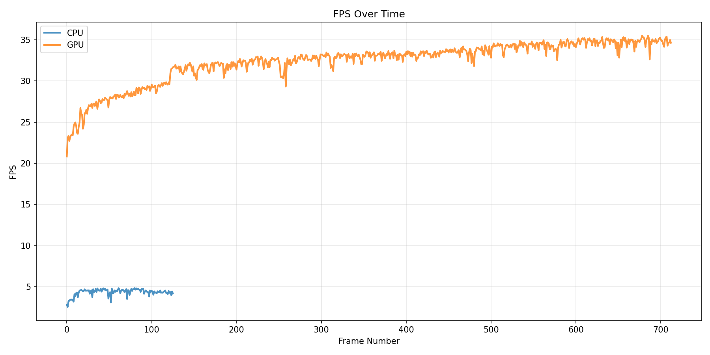
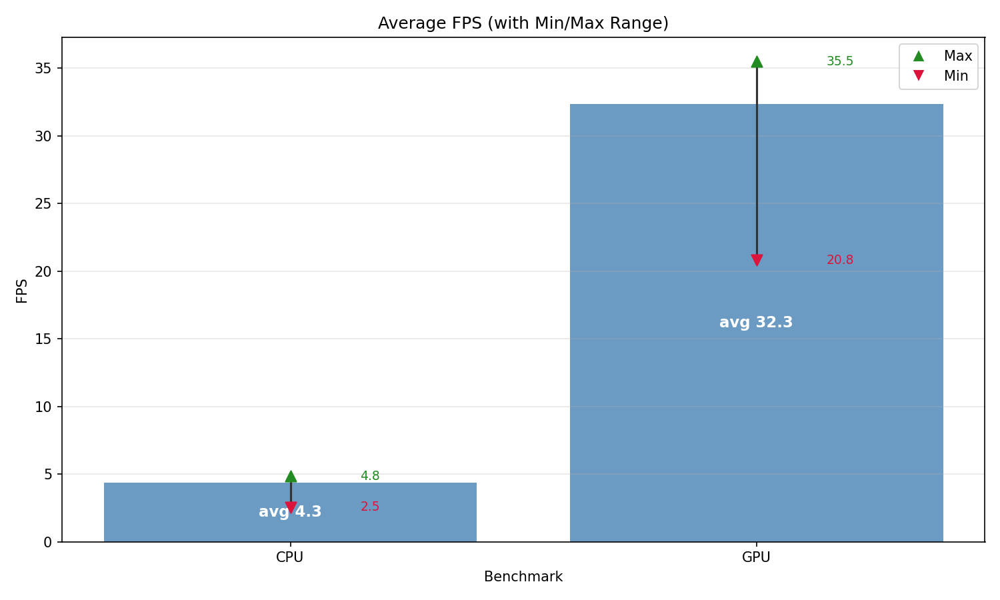
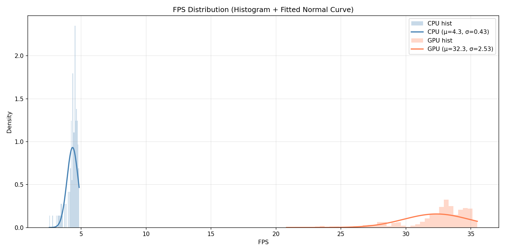

# ECE191-Camera-bench
This is a compute benchmark for the yolo models in the tritonai repository for obj detection.
https://github.com/Triton-AI/Camera_fusion2025

## Prerqeuisite info

This test was run with:
* CUDA 11.4
* torch 2.1.0a0+41361538.nv23.6
* torchvision 0.16.0+fbb4cc5
* cat /etc/nv_tegra_release -> R35 (release), REVISION: 4.1, GCID: 33958178, BOARD: t186ref, EABI: aarch64, DATE: Tue Aug  1 19:57:35 UTC 2023
* opencv-python  (technically only used for display)

To ensure maximum performance set the following:
* `sudo nvpmodel -m 0` - set power profile to MAXN
* `sudo jetson_clocks` - set compute and memory to max clocks

No instabilities were observed from these commands. You can verify these changes in `jtop`.

⚠️ Warning both torch was built from sources provided by nvidia and 0.16  for torchvision was needed to get this to work.
* `/models` - a few models taken from the tritonai repository that were used to test.
* `/performance` - benchmark scripts that generate `CPU.txt`/`GPU.txt` timing data and plotting utilities for FPS analysis.
* `/tests` - pre benchmark tests that should run without errors. If errors encountered in benchmark, make sure this is confirmed to work beforehand.

## Usage
1. Run CUDA/PyTorch sanity checks:
   `python3 tests/torch_test.py`
2. Run benchmark (writes `CPU.txt` and `GPU.txt`):
   `python3 performance/benchmarkYOLO_cpu_min.py models/Nick_v1.1_yolo12_fast.pt --imgsz 160 --seconds 30`
3. Generate FPS plots from benchmark outputs:
   `python3 performance/gatherAndPlot.py`

## Benchmark results
Three "platforms" were tested. The Jetson AGX Xavier(16GB)'s CPU, iGPU and the OAK-D Pro W Camera's accelerator (RVC2).

### FPS Over Time

### Average FPS

### FPS Distribution

